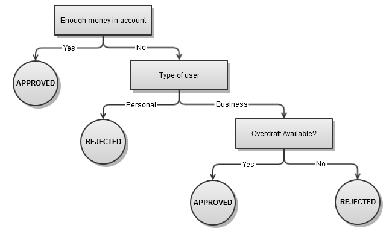

Vahina
======

** Decision tree / workflow for node.js **

This module is a simple decision tree module that aims to make it easier to replicate complex business workflows in code as closely as possible.


Usage
-----

### Installation

Vahina can be installed from npm. Since it is built on the power of ES6 generators, it requires node >= 0.11.x and must be run using `node --harmony` flag.

```
npm install vahina --save
```


### Example

Consider the following flow chart representing an approval process for a bank transaction:



This can be coded in code as follows:

```js
	var vahina = require('vahina');

	function *enoughMoney() {
		return (yield accountsModel.balance(this.fromAccount)) > this.amount;
	}

	function *processPayment() {
		yield accountsModel.process(this.fromAccount, this.toAccount, this.amount);
		return 'approved';
	}

	function *userType() {
		return yield userModel.getType(this.fromAccount);
	}

	function *overdraftAvailable() {
		return yield accountsModel.allowedToOverdraw(fromAccount);
	}

	function *processOverdraft() {
		yield processPayment.call(this);
		// call some other remote api
		yield overdraft.process(this.fromAccount);
		return 'approved';
	}

	var paymentFlow = {
		condition: enoughMoney,
		branch: {
			true: processPayment,
			false: {
				condition: userType,
				branch: {
					personal: 'rejected',
					business: {
						condition: overdraftAvailable,
						branch: {
							true: processOverdraft,
							false: 'rejected'
						}
					}
				}
			}
		}
	};

	var transaction = { fromAccount: 123, toAccount: 456, amount: 200 };

	// wrap call to vahina since no error guarding is offered by default
	// this is left upto the user
	var result;
	try {
		result = yield vahina.run(transaction, approvalFlow);
	} catch(e) {
		console.error(e);
		result = 'rejected';
	}
```

A generator function must be provided as the condition. The value returned by the condition is searched for as the branch. The matching branch is then yielded if it is a generator function, else the value assigned to the branch is returned.


Changelog
---------

### v0.0.1
- Initial commit